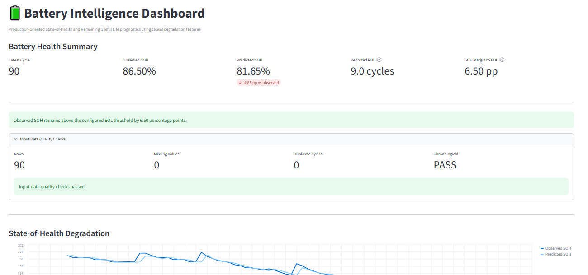

# Battery Intelligence: SOH & Remaining Useful Life Prognostics

An end-to-end battery analytics and prognostics project for **State-of-Health (SOH) estimation, Remaining Useful Life (RUL) prediction, degradation analysis, cross-battery validation, explainability, and production-oriented inference** using the NASA lithium-ion battery ageing dataset.

[](https://battery-intelligence.streamlit.app/)
[](https://github.com/Nano-hemu/Battery-Analytics-Portfolio/actions/workflows/tests.yml)

## Live Battery Intelligence Dashboard

## Live Battery Intelligence Dashboard

### [Launch Battery Intelligence →](https://battery-intelligence.streamlit.app/)

[](https://battery-intelligence.streamlit.app/)

**Interactive application:**  
https://battery-intelligence.streamlit.app/

The deployed dashboard accepts battery-history CSV data and provides SOH estimation, RUL prediction, degradation trajectories, EOL diagnostics, capacity and temperature trends, input-quality checks, and model metadata.

The example above shows a B0005 trajectory through discharge cycle 90:

- Observed SOH: **86.50%**
- Predicted SOH: **81.65%**
- Reported RUL: **9.0 cycles**
- SOH margin to the configured 80% EOL threshold: **6.50 percentage points**
- Input quality checks: **PASS**

The project is designed around a central engineering question:

> **Can battery degradation history be converted into a causal, transferable, and operationally defensible estimate of battery health and remaining useful life?**

Rather than optimizing only for a high in-sample score, this repository emphasizes:

- physically meaningful battery-health signals,
- leakage-resistant time-series feature engineering,
- chronological validation,
- leave-one-battery-out generalization,
- degradation-regime analysis,
- model failure investigation,
- uncertainty validation,
- explainability,
- production inference constraints,
- automated testing and CI,
- and an interactive Streamlit engineering dashboard.

---

## Project Highlights

| Area | Implementation |
|---|---|
| Battery health | Capacity degradation and SOH analysis |
| Prognostics | Remaining Useful Life prediction |
| Time-series design | Lagged and rolling causal features |
| Leakage control | Current cycle, current SOH, and current capacity excluded from RUL predictors |
| Validation | Chronological holdout + Leave-One-Battery-Out validation |
| Generalization | B0005, B0006, B0007, B0018 |
| Models | Linear Regression, Ridge, Random Forest, XGBoost diagnostics |
| Explainability | SHAP + standardized coefficient analysis |
| Uncertainty | Chronological conformal prediction experiment |
| Production | Serialized SOH/RUL models + inference engine |
| Dashboard | Streamlit battery intelligence interface |
| Software quality | Pytest + GitHub Actions CI |
| Stack | Python, pandas, NumPy, SciPy, scikit-learn, SHAP, Statsmodels, XGBoost, Streamlit |

---

# 1. Why This Project Matters

Battery prognostics is not simply a regression problem.

A model can achieve apparently strong accuracy while being unusable in a real deployment because of:

- target leakage,
- future-information leakage,
- random train/test splitting of degradation trajectories,
- battery-specific overfitting,
- extrapolation beyond the training degradation regime,
- nonphysical negative RUL predictions,
- unreliable uncertainty estimates,
- or poor transfer to another cell.

This project therefore treats battery prognostics as a combined:

**electrochemistry + time-series + machine-learning + reliability-engineering problem.**

The workflow progresses from exploratory degradation analysis to causal modelling, cross-battery validation, uncertainty diagnostics, explainability, and finally a production-style inference interface.

---

# 2. Dataset

The project uses four lithium-ion ageing cells from the NASA battery ageing dataset:

- B0005
- B0006
- B0007
- B0018

Raw MATLAB files are intentionally **not redistributed in this repository**.

Expected local structure:

```text
data/
└── raw/
    ├── B0005.mat
    ├── B0006.mat
    ├── B0007.mat
    └── B0018.mat
```

See [`data/README.md`](data/README.md) for dataset acquisition, indexing methodology, EOL definition, and local setup instructions.

---

# 3. Critical Data-Engineering Decision

One of the most important corrections in this project concerns the NASA MATLAB `cycle` structure.

The raw structure contains operation records including charge, discharge, and impedance events. Therefore, the original record index is **not equivalent to discharge-cycle count**.

The loader preserves:

```text
record_index
```

as the original NASA event position and constructs:

```text
discharge_cycle
```

as the sequential discharge count.

For downstream modelling:

```text
cycle = discharge_cycle
```

This distinction prevents incorrect ageing timelines and incorrect EOL/RUL calculations.

---

# 4. Battery Health Definition

State of Health is defined from discharge capacity relative to initial measured capacity:

$$
SOH_t = \frac{Q_t}{Q_0} \times 100
$$

where:

- \(Q_t\) = measured discharge capacity at cycle \(t\)
- \(Q_0\) = initial measured discharge capacity

The project uses a fixed engineering EOL criterion:

$$
SOH \leq 80\%
$$

The observed EOL cycle is the first measured discharge cycle satisfying this condition.

For observations before EOL:

$$
RUL_t = EOL_{\mathrm{cycle}} - t
$$

This definition is used consistently across the modelling pipeline.

---

# 5. Why Cycle Number Is Not an RUL Feature

A naive RUL model can appear nearly perfect if cycle number is included.

Because:

$$
RUL_t = EOL_{\mathrm{cycle}} - cycle_t
$$

once the EOL cycle is known, cycle number almost reconstructs the target directly.

This creates a misleadingly strong prediction problem.

Therefore:

> **Cycle number is deliberately excluded from the deployable RUL feature set.**

The same reasoning is applied to current SOH and current capacity. The RUL model is designed to rely on historical health information rather than directly using variables that strongly encode target construction.

---

# 6. Causal Feature Engineering

The deployable prognostic feature set is:

```python
[
    "SOH_lag1",
    "SOH_roll_mean_5",
    "SOH_roll_std_5",
    "SOH_delta_5",
    "temp_roll_mean_5",
    "temperature_delta_5",
    "voltage_roll_mean_5",
]
```

These features are constructed from battery history so that the prognostic model uses historical degradation information rather than future observations.

### Health-History Features

#### Previous SOH

The previous measured State of Health is:

```text
SOH_lag1(t) = SOH(t − 1)
```

This gives the model the most recent available battery-health state without using the current-cycle SOH directly as an RUL predictor.

#### Rolling SOH Mean

For a historical window of length `w`:

```text
SOH_roll_mean(t,w) = (1/w) × Σ SOHᵢ
                              i=t−w,...,t−1
```

Conceptually,

```text
SOH_roll_mean(t,w)
    = [SOH(t−w) + ... + SOH(t−2) + SOH(t−1)] / w
```

The rolling mean represents the recent local health level while reducing sensitivity to individual-cycle fluctuations.

#### Rolling SOH Variability

Historical SOH variability is represented by the sample standard deviation over the same causal window:

```text
SOH_roll_std(t,w)
    = √{ Σ[SOHᵢ − SOH_roll_mean(t,w)]² / (w − 1) }

      for i = t−w,...,t−1
```

This feature measures short-term variability around the recent degradation trajectory. A larger value indicates that recent SOH observations are fluctuating more strongly around their local mean.

#### SOH Degradation Delta

The recent change in SOH is represented conceptually as:

```text
SOH_delta(t,w) = SOH(t−1) − SOH(t−w)
```

This feature captures the direction and magnitude of recent movement in the health trajectory.

### Thermal-History Features

The model also uses historical temperature behaviour:

- `temp_roll_mean_5` — recent rolling mean of maximum temperature.
- `temperature_delta_5` — recent change in maximum temperature.

These features provide information about changes in thermal operating behaviour associated with ageing and experimental conditions.

### Voltage-History Features

The feature:

```text
voltage_roll_mean_5
```

summarizes recent discharge-voltage behaviour and provides an additional indicator of changing battery condition.

For the production model:

```text
Historical feature window = 5 discharge observations
```

The central design principle is:

> **RUL at cycle t should be estimated from information available before the prediction point, rather than from future degradation observations or variables that directly reconstruct the target.**

---

# 7. Modelling Strategy

The project intentionally compares simple and nonlinear models rather than assuming that higher model complexity produces better prognostics.

Models investigated include:

- Linear Regression
- Ridge Regression
- Random Forest
- XGBoost
- polynomial degradation models
- trajectory-based degradation models

A major result of the project is that **simpler linear models generalized better than tree ensembles for the final multi-battery RUL problem**.

> Model complexity is not a substitute for validation across degradation regimes.

---

# 8. B0005 Case Study

B0005 contains:

```text
168 discharge observations
```

Initial capacity:

```text
1.8565 Ah
```

Final capacity:

```text
1.3251 Ah
```

Final SOH:

```text
71.38%
```

Observed EOL:

```text
Cycle 101
```

with measured SOH:

```text
79.74%
```

The pre-EOL RUL modelling region therefore spans cycles before cycle 101.

---

# 9. Instantaneous vs Causal Prognostics

An early health-based model used instantaneous health variables.

For B0005:

| Model | MAE | RMSE | R² |
|---|---:|---:|---:|
| Instantaneous Linear RUL | 5.46 cycles | 7.24 cycles | 0.300 |
| Causal Ridge RUL | 4.93 cycles raw | — | — |
| Causal Ridge RUL after nonnegative constraint | 3.94 cycles | — | — |

The causal formulation was especially important around temporary capacity-recovery behaviour.

For example, B0005 showed:

| Cycle | SOH |
|---:|---:|
| 89 | 81.74% |
| 90 | 86.50% |
| 91 | 84.24% |

At cycle 90, an instantaneous model produced an RUL estimate of approximately:

```text
31.28 cycles
```

whereas the causal model produced approximately:

```text
7.82 cycles
```

against an actual remaining life of:

```text
11 cycles
```

This illustrates why isolated instantaneous measurements can be misleading during temporary capacity recovery.

---

# 10. Multi-Battery Validation

The four cells show substantially different degradation trajectories.

| Battery | Observed EOL cycle |
|---|---:|
| B0005 | 101 |
| B0006 | 61 |
| B0007 | 124 |
| B0018 | 75 |

The observed EOL spread across the cells is:

```text
63 cycles
```

This heterogeneity makes cross-battery validation significantly more informative than random train/test splitting.

---

# 11. Leave-One-Battery-Out Validation

The final model-family comparison used **Leave-One-Battery-Out (LOBO)** validation.

For each fold:

1. three batteries are used for training,
2. one complete battery is withheld,
3. the model predicts the unseen battery trajectory.

This tests whether learned degradation relationships transfer between cells.

## RUL Results

Linear Regression was selected as the final RUL model family.

Aggregate LOBO performance:

| Metric | Result |
|---|---:|
| Macro MAE | **10.25 cycles** |
| Macro RMSE | **12.27 cycles** |
| Macro R² | **0.666** |
| Pooled MAE | **10.74 cycles** |
| Pooled RMSE | **13.09 cycles** |
| Pooled R² | **0.803** |
| Pooled bias | **−2.50 cycles** |

Ridge Regression was close but slightly weaker overall.

Random Forest generalized materially worse across the battery folds.

---

# 12. SOH Generalizes Better Than RUL

One of the strongest conclusions from the project is that SOH estimation transfers substantially better across cells than RUL prediction.

LOBO SOH performance using Linear Regression:

| Metric | Result |
|---|---:|
| Macro MAE | **0.493 percentage points** |
| Pooled MAE | **0.482 percentage points** |
| Pooled R² | **0.993** |

This difference is physically and statistically important.

SOH is a present-state health variable.

RUL requires extrapolating the future degradation path to a threshold.

Therefore, RUL is inherently more sensitive to:

- future degradation regime,
- cell-to-cell variability,
- operating history,
- threshold definition,
- and degradation-rate changes.

---

# 13. Regime Shift and Out-of-Distribution Behaviour

Cross-battery analysis revealed that poor transfer cannot be explained only by simple feature-range violations.

For example:

- B0007 exhibited clear target-range extrapolation.
- B0006 remained difficult despite not showing the same target-range OOD behaviour.

Simple min/max feature checks and standardized-distance metrics were therefore insufficient as reliable confidence indicators.

> **Battery prognostic uncertainty is driven by degradation-regime shift, not merely geometric distance in feature space.**

---

# 14. Why Monotonic RUL Was Not Forced

Remaining life should trend downward globally, so imposing a monotonically decreasing prediction trajectory can appear attractive.

A running-minimum postprocessing rule was tested.

It improved some batteries but worsened others.

Therefore it was **not adopted as the default production behaviour**.

The production layer applies only the defensible physical constraint:

$$
RUL_{\mathrm{reported}} = \max(0, RUL_{\mathrm{raw}})
$$

and additionally forces reported RUL to zero when observed SOH has reached the configured EOL threshold.

This preserves local model information without introducing an empirically unsupported trajectory transformation.

---

# 15. Uncertainty Quantification

Chronological conformal prediction was investigated for RUL uncertainty.

Under degradation-regime shift, the nominal:

```text
90% prediction interval
```

achieved only approximately:

```text
26.32% empirical coverage
```

in the tested chronological setting.

Therefore the project deliberately does **not** expose those intervals in the production dashboard.

A narrow uncertainty interval is not useful if its empirical coverage is unreliable.

---

# 16. Explainability

SHAP and standardized linear-model coefficients were used to investigate model behaviour.

The analysis indicated that recent SOH-history features are dominant predictors.

For the final RUL model, standardized coefficient magnitudes included approximately:

| Feature | Standardized coefficient |
|---|---:|
| SOH rolling mean | +24.01 |
| SOH lag-1 | +13.52 |
| Voltage rolling mean | −9.53 |
| Temperature rolling mean | +8.40 |
| SOH rolling standard deviation | −4.21 |

These values describe the fitted model's conditional associations.

They should **not** be interpreted as causal electrochemical mechanisms, particularly because rolling and lagged predictors are correlated.

---

# 17. Production Model

After LOBO model-family selection, the final models were refitted using all four batteries.

Both serialized production models use:

```text
StandardScaler
    ↓
LinearRegression
```

Artifacts:

```text
models/
├── soh_model.joblib
├── rul_model.joblib
└── model_metadata.json
```

The exact serialized final model has been trained on all four available cells.

Therefore:

> The LOBO results validate the selected modelling strategy, but the exact final refitted artifact does not have an additional unseen fifth-cell validation set.

This distinction is important when interpreting production-model performance.

---

# 18. Production Inference Contract

The production interface is implemented in:

```text
src/inference.py
```

Primary interface:

```python
BatteryPrognosticsEngine
```

Given a valid battery-history dataframe, the engine returns:

```python
{
    "model_version": ...,
    "cycle": ...,
    "observed_soh_percent": ...,
    "predicted_soh_percent": ...,
    "raw_rul_cycles": ...,
    "reported_rul_cycles": ...,
    "eol_threshold_soh_percent": ...,
    "eol_reached": ...,
}
```

The engine also validates:

- required columns,
- missing/nonfinite values,
- duplicate cycles,
- chronological ordering,
- model metadata,
- feature ordering,
- EOL threshold consistency.

---

# 19. Example Production Inference

For B0005 history through discharge cycle 90:

```text
Observed SOH       ≈ 86.50%
Predicted SOH      ≈ 81.65%
Raw RUL            ≈ 9.05 cycles
Reported RUL       ≈ 9.05 cycles
Historical EOL     = cycle 101
Actual RUL         = 11 cycles
Prediction error   ≈ −1.95 cycles
```

The difference between measured and model-estimated SOH at cycle 90 reflects the temporary capacity-recovery event.

It should be interpreted as **model-state disagreement**, not automatically as sensor error.

---

# 20. Streamlit Battery Intelligence Dashboard

### [Launch the Live Dashboard →](https://battery-intelligence.streamlit.app/)

The repository includes an interactive engineering dashboard:

```text
app/
├── streamlit_app.py
└── dashboard_utils.py
```

The dashboard provides:

- battery-history CSV upload,
- input quality validation,
- current observed SOH,
- model-estimated SOH,
- SOH margin to EOL,
- reported RUL,
- observed vs predicted SOH trajectory,
- visible 80% EOL threshold,
- raw vs constrained RUL trajectory,
- capacity degradation,
- maximum-temperature evolution,
- latest prognostic output,
- model version,
- and deployment limitations.

Run locally with:

```bash
streamlit run app/streamlit_app.py
```

---

# 21. Repository Architecture

```text
Battery-Analytics-Portfolio/
│
├── app/
│   ├── streamlit_app.py
│   └── dashboard_utils.py
│
├── data/
│   ├── raw/
│   │   └── NASA .mat files — local only, not version controlled
│   └── README.md
│
├── models/
│   ├── soh_model.joblib
│   ├── rul_model.joblib
│   └── model_metadata.json
│
├── notebooks/
│   ├── 01_Battery_Intelligence_EDA.ipynb
│   ├── 02_Battery_SOHandRUL_Predictive_Modeling.ipynb
│   ├── 03_Advanced_Battery_Prognostics.ipynb
│   ├── 04_Multi_Battery_Validation_and_SHAP.ipynb
│   └── 05_Production_Battery_Prognostics.ipynb
│
├── src/
│   ├── nasa_loader.py
│   ├── battery_features.py
│   ├── prognostics.py
│   └── inference.py
│
├── tests/
│   ├── test_inference.py
│   ├── test_inference_synthetic.py
│   └── test_streamlit_app.py
│
├── .github/
│   └── workflows/
│       └── tests.yml
│
├── requirements.txt
├── requirements-dev.txt
├── LICENSE
├── .gitignore
└── README.md
```

---

# 22. Notebook Roadmap

## Notebook 01 — Battery Intelligence EDA

Focus:

- NASA MATLAB parsing,
- discharge-cycle reconstruction,
- capacity degradation,
- SOH calculation,
- EOL definition,
- temperature-health relationships,
- instantaneous health models,
- leakage diagnostics.

## Notebook 02 — Causal SOH & RUL Modelling

Focus:

- lagged features,
- rolling degradation statistics,
- chronological modelling,
- linear/Ridge/Random Forest comparison,
- nonnegative RUL constraint,
- cross-battery transfer diagnostics.

## Notebook 03 — Advanced Battery Prognostics

Focus:

- trajectory-based degradation models,
- chronological uncertainty estimation,
- conformal prediction,
- regime-shift failure analysis.

## Notebook 04 — Multi-Battery Validation & SHAP

Focus:

- B0005/B0006/B0007/B0018 integration,
- Leave-One-Battery-Out validation,
- model-family selection,
- OOD diagnostics,
- SHAP interpretation,
- monotonic postprocessing experiments,
- SOH vs RUL generalization.

## Notebook 05 — Production Battery Prognostics

Focus:

- final feature pipeline,
- model refitting,
- artifact serialization,
- inference parity,
- production constraints,
- metadata,
- deployment interface.

---

# 23. Installation

Clone the repository:

```bash
git clone https://github.com/Nano-hemu/Battery-Analytics-Portfolio.git
cd Battery-Analytics-Portfolio
```

Create a virtual environment.

### Windows — Git Bash

```bash
python -m venv .venv
source .venv/Scripts/activate
```

### Linux/macOS

```bash
python -m venv .venv
source .venv/bin/activate
```

Install project dependencies:

```bash
python -m pip install --upgrade pip
pip install -r requirements.txt
```

For development and testing:

```bash
pip install -r requirements-dev.txt
```

---

# 24. Running the Tests

Run the complete local test suite:

```bash
pytest -q
```

The current project test suite contains:

```text
14 passing tests
```

covering:

- model loading,
- metadata validation,
- feature ordering,
- prediction schema,
- RUL clipping,
- EOL safeguard,
- malformed input,
- synthetic inference behaviour,
- and dashboard module compilation.

Raw NASA data is intentionally excluded from the repository.

Therefore CI uses portable synthetic inference tests that do not require redistribution of the original MATLAB files.

---

# 25. Continuous Integration

GitHub Actions automatically executes the portable test suite for repository changes.

Workflow:

```text
.github/workflows/tests.yml
```

The current workflow is configured to test the production inference path and dashboard code in a clean environment.

---

# 26. Technology Stack

### Data Engineering

- Python
- NumPy
- pandas
- SciPy

### Machine Learning

- scikit-learn
- XGBoost
- joblib

### Statistical Analysis

- Statsmodels

### Explainability

- SHAP

### Visualization & Application

- Matplotlib
- Altair
- Streamlit

### Software Engineering

- Git
- GitHub
- pytest
- GitHub Actions
- serialized model artifacts
- modular inference architecture

---

# 27. Key Engineering Lessons

### 1. Correct indexing matters before modelling

Misinterpreting operation records as discharge cycles changes the entire degradation timeline.

### 2. High R² can be meaningless

Cycle number can reconstruct RUL algebraically and create a nearly perfect but non-informative model.

### 3. Temporal leakage must be designed out

Rolling features must use historical information rather than future observations.

### 4. Random splitting is weak validation for degradation trajectories

Chronological and battery-level holdouts are more representative of the deployment problem.

### 5. SOH and RUL are different prediction problems

Present health can transfer well while future lifetime remains difficult.

### 6. More complex ML is not automatically better

Linear models generalized better than tree ensembles in the final LOBO RUL comparison.

### 7. Physical postprocessing requires validation

A monotonic constraint may appear physically reasonable but can still degrade predictive accuracy.

### 8. Uncertainty must be validated

Nominal confidence levels are not meaningful when empirical coverage collapses under regime shift.

### 9. Explainability is not causality

SHAP values and coefficients explain model behaviour, not electrochemical mechanism.

### 10. Production behaviour is part of model design

Input validation, feature ordering, EOL safeguards, nonnegative RUL, metadata, testing, and CI are part of the prognostic system—not afterthoughts.

---

# 28. Current Limitations

This project intentionally documents its limitations.

### Dataset scale

Only four cells from one NASA laboratory ageing dataset are used.

### Operating-domain coverage

The project does not establish transfer across:

- different chemistries,
- different manufacturers,
- different cell formats,
- arbitrary field duty cycles,
- pack-level thermal gradients,
- or real EV/ESS fleets.

### EOL definition

The production configuration uses a fixed:

```text
80% SOH
```

threshold.

Different applications may require different retirement criteria.

### Uncertainty

No production confidence interval is shown because the tested chronological conformal method did not achieve reliable empirical coverage.

### Final artifact validation

The final serialized models were refitted on all four batteries after LOBO model-family selection and therefore do not have a separate unseen fifth-cell validation set.

### Deployment scope

This repository is an engineering analytics and portfolio implementation.

It is not a certified BMS safety algorithm and should not be used as the sole basis for safety-critical battery decisions.

---

# 29. Future Engineering Extensions

Potential next-stage work includes:

- larger multi-cell ageing datasets,
- field-installed battery telemetry,
- chemistry-specific models,
- dynamic current/voltage waveform features,
- incremental online inference,
- probabilistic degradation-state models,
- survival analysis,
- Bayesian state-space models,
- Kalman/particle filtering,
- physics-informed ML,
- PyBaMM-derived latent features,
- EIS-informed health indicators,
- domain adaptation,
- calibrated OOD detection,
- fleet-level hierarchical modelling,
- and deployment through an API or cloud monitoring service.

---

# 30. Engineering Objective

The purpose of this repository is not to claim that battery RUL is solved.

The objective is to demonstrate a rigorous workflow for approaching battery prognostics:

```text
Raw ageing data
      ↓
Correct cycle reconstruction
      ↓
Electrochemical degradation analysis
      ↓
SOH / EOL definition
      ↓
Leakage diagnostics
      ↓
Causal time-series features
      ↓
Chronological validation
      ↓
Cross-battery validation
      ↓
Regime-shift analysis
      ↓
Explainability
      ↓
Uncertainty validation
      ↓
Production model selection
      ↓
Serialized inference pipeline
      ↓
Automated tests + CI
      ↓
Interactive engineering dashboard
```

The central conclusion is:

> **Reliable battery prognostics requires more than predictive accuracy. It requires correct target construction, causal feature design, cross-cell validation, explicit treatment of degradation-regime shift, physically defensible output constraints, and transparent communication of model limitations.**

---

## Live Application

### [Battery Intelligence Dashboard →](https://battery-intelligence.streamlit.app/)

---

## Author

**Hemant Kumar Jaiswal**

Chemical Engineering | Electrochemistry | Battery Analytics | Energy Storage | Python & Machine Learning